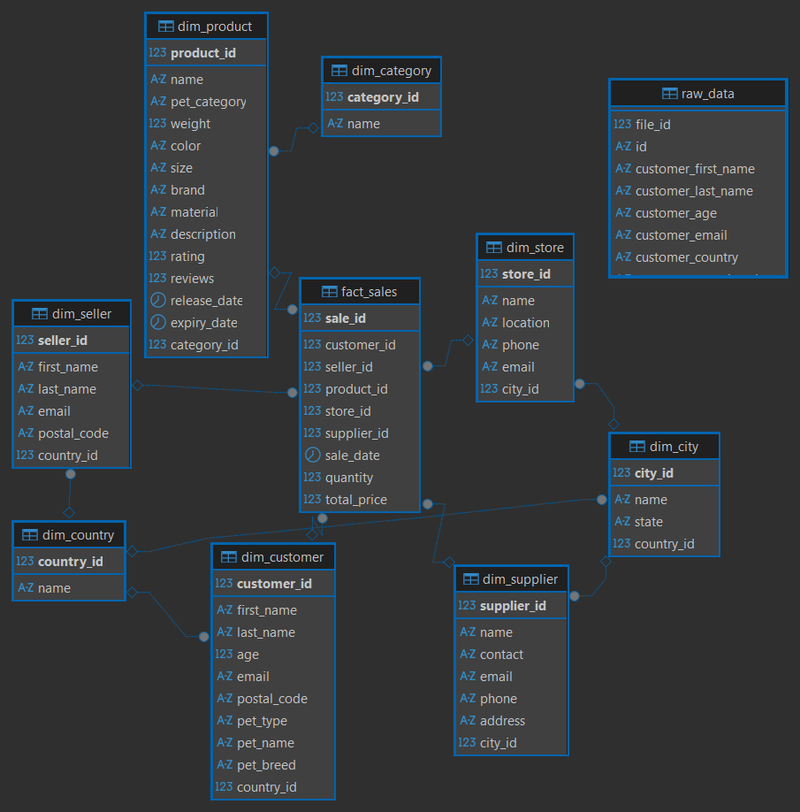
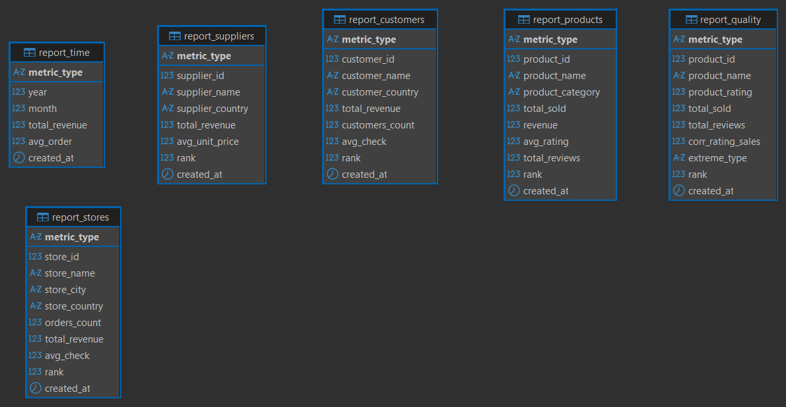

# BigDataSpark

Анализ больших данных - лабораторная работа №2 - ETL реализованный с помощью Spark

## Цель работы

Необходимо реализовать ETL-пайплайн с помощью Spark, который трансформирует данные из источника (файлы mock_data.csv с номерами) в модель данных звезда в PostgreSQL, а затем на основе модели данных звезда создать ряд отчетов по данным в одной из NoSQL базах данных обязательно и в нескольких других опционально (будет бонусом). Каждый отчет представляет собой отдельную таблицу в NoSQL БД.

## Что сделано

1. Настроены сервисы `jupyter/pyspark-notebook` и `clickhouse/clickhouse-server`
2. Реализован Spark job `raw_to_star.py`
3. Реализован Spark job `star_to_clickhouse_reports.py`
	- формирование 6 витрин: `report_products`, `report_customers`, `report_time`, `report_stores`, `report_suppliers`, `report_quality`

## Вид звезды



## Вид отчетов в clickhouse



## Запуск

```bash
docker compose up
```

## Построить звезду в PostgreSQL:

```bash
podman compose exec spark spark-submit --jars /home/jovyan/work/jars/postgresql-42.7.4.jar /home/jovyan/work/jobs/raw_to_star.py
```

## Построить витрины в ClickHouse:

```bash
podman compose exec spark env CH_USER=default CH_PASSWORD=clickhouse spark-submit --jars /home/jovyan/work/jars/postgresql-42.7.4.jar,/home/jovyan/work/jars/clickhouse-jdbc-0.7.2-all.jar /home/jovyan/work/jobs/star_to_clickhouse_reports.py
```
